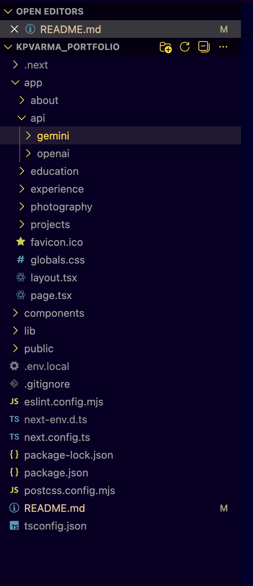
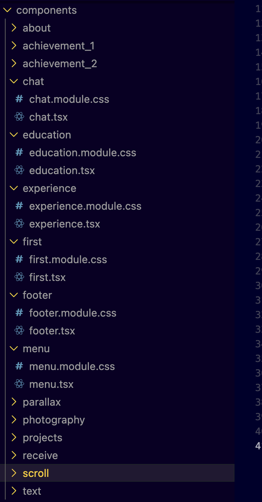

# 🚀 KP VARMA {MY BROTHER} – Portfolio Website

A modern, high-performance personal portfolio built using **Next.js**, **GSAP**, and **CSS Modules**, showcasing smooth animations, interactive UI, and clean design principles.

🔗 **Live Website:** https://kpvarma.vercel.app/

---

## ✨ Features

- ⚡ Built with **Next.js (App Router)**
- 🎬 Advanced animations using **GSAP & ScrollTrigger**
- 🎨 Clean, responsive UI with **CSS Modules**
- 🧩 Component-based architecture
- 🌐 Optimized for performance & SEO
- 📱 Fully responsive (Desktop, Tablet, Mobile)
- 🚀 Deployed on **Vercel**

---

## 🛠 Tech Stack

| Technology | Usage |
|----------|------|
| **Next.js** | Framework & routing |
| **React** | UI components |
| **GSAP** | Animations & interactions |
| **ScrollTrigger** | Scroll-based animations |
| **CSS Modules** | Scoped styling |
| **React Icons** | Icons |
| **Vercel** | Deployment |

---

## 📂 Project Structure



## components




---

## 🚀 Getting Started (Local Setup)

### 1️⃣ Clone the repository
```bash
git clone https://github.com/your-username/kpvarma_portfolio.git
cd kpvarma_portfolio

###2️⃣ Install dependencies

```bash
npm install

###3️⃣ Run development server

```bash
npm run dev

Open 👉 http://localhost:3000

###🎬 GSAP Animations

This project uses:

GSAP core

ScrollTrigger

Custom reveal, stagger, and scroll-based animations

All animation logic is carefully handled inside Client Components using:

"use client";

##📦 Deployment

The website is deployed using Vercel with automatic CI/CD.

Every push to the main branch triggers a new deployment.

🔗 Live: https://kpvarma.vercel.app/

##🧠 Learning Outcomes

Deep understanding of Next.js App Router

Real-world GSAP animation workflows

Performance-optimized UI development

Clean component architecture

Deployment & production debugging

##📬 Contact

🌐 Portfolio: https://kpvarma.vercel.app/

💼 LinkedIn: ()

📧 Email: (venkatsaikondra67@gmail.com)

##⭐ Show Your Support

If you like this project:

⭐ Star the repository

🍴 Fork it

🧠 Learn from it

--

## ✅ Optional Enhancements (I can add these for you)
- Animated GIF preview section
- Lighthouse performance badge
- Resume download link
- Dark/Light mode mention
- Contribution guidelines

If you want a **more premium / recruiter-level README**, tell me:
- Student or professional?
- Target role (Frontend / Full-Stack / UI Engineer)?
- Want minimal or flashy?

I’ll upgrade it accordingly 🔥

